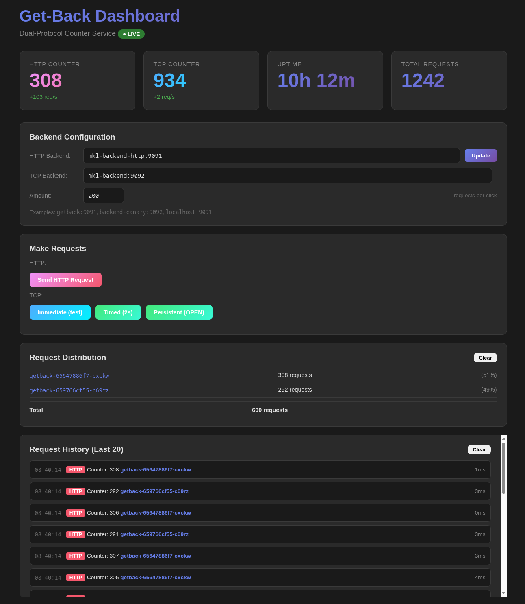

# Getback - demonstrating and testing Skupper


[](https://deepwiki.com/pwright/get-back)


A network service with HTTP and TCP counters, plus an **interactive web console** for real-time load balancing demonstration. 

**Ports:**
- 🎯 **Dashboard**: 9093 (Interactive console with request distribution visualization)
- 📡 **TCP**: 9092 (Command-based protocol)
- 🌐 **HTTP**: 9091 (REST counter endpoint)

## Quick Start: Skupper Multi-Cluster

Deploy across multiple sites (east, west) with Skupper VAN:

```bash
# Deploy to west cluster
kubectl apply -f west/deployment.yaml
kubectl apply -f west/service.yaml      # ← Local service access
kubectl apply -f west/connectors.yaml   # ← Expose to Skupper network
kubectl apply -f west/listeners.yaml    # ← Aggregate all sites

# Deploy to east cluster  
kubectl apply -f east/deployment.yaml
kubectl apply -f east/connectors.yaml   # ← Expose to Skupper network

# Access the console
kubectl port-forward -n west svc/getback 9093:9093
# Open http://localhost:9093/
```

**Directory structure:**
```
west/
├── deployment.yaml    # 1 replica, quay.io image, namespace: west
├── service.yaml       # ClusterIP for dashboard only (getback-dashboard)
├── connectors.yaml    # Skupper connectors (expose to network)
└── listeners.yaml     # Skupper listeners (aggregate sites)

east/
├── deployment.yaml    # 1 replica, quay.io image, namespace: east
└── connectors.yaml    # Skupper connectors
```

**Interactive console features:**
- Set **Amount** to send N concurrent requests (e.g., 100)
- Click buttons to send HTTP/TCP requests
- **Distribution panel** shows breakdown per pod/site
- Watch real-time load balancing across clusters!



**Prerequisites:** Push image to `quay.io/pwright/getback:latest` (or update image refs)

## Quick Start: API Usage

**Trigger 100 TCP connections and get stats:**


```bash
kubectl exec -it -n west deployment/getback -- bash

# Send 100 concurrent TCP requests via API
 curl -v -X POST http://localhost:9093/api/request/http \
    -H 'Content-Type: application/json' \
    -d '{"backend":"mkl-backend-http:9091","amount":100,"tls":false}'
# Response includes per-request results:
{
  "results": [
    {"counter": 1, "server": "pod-1", "latency_ms": 5, "timestamp": 1715812345, "command": "test"},
    {"counter": 2, "server": "pod-2", "latency_ms": 8, "timestamp": 1715812346, "command": "test"},
    ...
  ],
  "total": 100,
  "successful": 98
}


# Get distribution across servers
curl http://localhost:9093/api/distribution


# Get latency statistics (last N requests, default 1000)
curl http://localhost:9093/stats

# Response includes aggregates:
{
  "http_counter": 2453,
  "tcp_counter": 7450,
  "active_tcp_connections": 50,
  "latency": {
    "tcp": {
      "min": 3, "max": 50, "avg": 15,
      "p50": 12, "p95": 30, "p99": 42,
      "count": 100
    }
  }
}


# Or use the pre-built batch client
python clients/batch_tcp_client.py http://localhost:9093 myhost:9092 test 100
```

**Command types:**
- `"test"` (or any string) — immediate close after response
- `"5"` (numeric) — linger for 5 seconds
- `"OPEN"` — persistent connection

**See [API Reference](#api-reference) for complete documentation**

## Quick Start: Local Development

```bash
# Run locally
python -m getback

# Open interactive dashboard
open http://localhost:9093/
# Or visit in browser and click "Send HTTP Request" button

# Test HTTP endpoint directly
curl http://localhost:9091/  # Returns: 1 (hostname)

# Test TCP endpoint
echo "test" | nc localhost 9092  # Returns: 1 (hostname)

# Test with server identity
curl http://localhost:9091/  # Returns: 2 (laptop.local)
echo "OPEN" | nc localhost 9092  # Returns: 2 (laptop.local) - persistent
```

## Features

### Core Protocol Support
- **Dual Protocol**: HTTP (port 9091) and TCP (port 9092)
- **Independent Counters**: Each protocol maintains its own atomic counter
- **Server Identity**: Responses include pod/hostname for tracking load distribution
- **TCP Command Protocol**:
  - Send numeric value (e.g., `"5"`) → stays open N seconds
  - Send `"OPEN"` → persistent connection
  - Send anything else → immediate close

### Interactive Dashboard (port 9093)
- **Request Controls**: Send 1-100 concurrent requests with single click (HTTP, Pulse, Linger, Hold open, Cycle)
- **Load Cycling**: Continuously ramp connections up (20s) and down (20s) to test autoscaling and sustained load patterns
- **Connection Management**: Track and close persistent TCP connections, stop active cycling
- **Server-Side Batching**: UI sends 1 request, server makes N concurrent backend requests (no browser limits)
- **Distribution Panel**: See request breakdown per server (e.g., "33, 33, 34" across 3 pods)
- **Stats API**: Server-side metrics with latency aggregates (min/max/avg/p50/p95/p99) via `/stats`
- **Distribution API**: Server-side tracking via `/api/distribution` for monitoring tools
- **OpenAPI Spec**: Full API documentation at `/openapi.json` (OpenAPI 3.0)
- **Request History**: Last 20 requests with latency and server identity
- **Backend Configuration**: Switch between services (e.g., `getback`, `getback-canary`)
- **Persistent State**: Distribution and history data survives page reloads (localStorage)

### Operational
- **Zero Dependencies**: Python 3.11+ standard library only
- **Health Probes**: `/health` endpoint for Kubernetes liveness/readiness
- **Graceful Shutdown**: 5-second timeout for clean pod termination
- **Multi-cluster Ready**: Works with Skupper
- **TLS Testing**: Optional TLS-enabled backend deployment for testing secure connections

## Dashboard Guide

The interactive dashboard (port 9093) is the main interface for demonstrating load balancing:

### Making Requests

1. **Set Amount**: 10 (default) - number of backend requests per click (server-side batching)
2. **Click buttons**:
   - `Send HTTP Requests` - dashboard server makes Amount concurrent HTTP requests to backend
   - `Pulse` - dashboard server makes Amount concurrent TCP requests (immediate close)
   - `Linger (2s)` - Amount TCP requests that stay open 2 seconds
   - `Hold open` - Amount TCP requests that stay open indefinitely
   - `Cycle` - **Continuous load cycling**: ramps up to Amount connections over 20s, ramps down to 0 over 20s, then repeats (40s/cycle). Continues until stopped with "Close All"
3. **Connection management**:
   - `Close All` - closes all persistent TCP connections and stops any active cycling

**How it works:**
- Browser sends **1 request** to dashboard with amount parameter
- Dashboard server makes **N concurrent requests** to backend internally
- Returns aggregated results (distribution, latencies, etc.)
- No browser connection limits - can handle large amounts (e.g., 1000)

### Distribution Panel

Shows aggregated request counts per server:

```
Request Distribution
────────────────────────────────────
getback-876777f64-dkrlv    34 requests  (34%)
getback-876777f64-kc6hw    33 requests  (33%)
getback-876777f64-kcszx    33 requests  (33%)
Total: 100 requests
```

**Key insights:**
- ✅ Even distribution (33%, 33%, 33%) = good load balancing
- ⚠️ Uneven (50%, 30%, 20%) = check session affinity or pod health
- ❌ Single server (100%, 0%, 0%) = session affinity enabled or service misconfigured

**Understanding the totals:**

The distribution panel shows **requests sent by the dashboard UI to backends** (client-side tracking):
- Tracked in browser localStorage (per-client view)
- Shows only requests made through UI buttons
- Total = sum of requests to all backend servers

This differs from `/stats` counters, which show **requests received by the dashboard container itself**:
- `http_counter`/`tcp_counter` = requests hitting the dashboard's own ports 9091/9092
- Useful when dashboard is deployed as a backend service (e.g., in Skupper multi-cluster)
- May exceed distribution totals if dashboard receives external traffic

**Example scenario:**
```
Distribution total: 15200 requests  ← Sent by dashboard UI to backends
/stats counters:     9903 requests  ← Received by dashboard container

Difference: Dashboard is both a client (sends 15200) and a server (receives 9903)
```

### Backend Configuration

Switch between services without reloading:

- **HTTP Backend**: `getback:9091` (default in Kubernetes)
  - **Use HTTPS checkbox**: Enable TLS/SSL encryption for HTTPS backends
- **TCP Backend**: `getback:9092`
  - **Use TLS checkbox**: Enable TLS encryption for TCP connections
- **Amount**: 10 (requests per click)

**Examples:**
- Test canary: Set HTTP to `getback-canary:9091`
- Test blue/green: Switch between `stable:9091` and `candidate:9091`
- Multi-cluster: Target `mkl-backend-http:9091` (Skupper listener)
- Test HTTPS: Enable "Use HTTPS" and set backend to `secure-backend:443`
- Test TLS TCP: Enable "Use TLS" and set backend to `tls-backend:9092`

**TLS Configuration:**
- Checkboxes control whether dashboard uses encrypted connections to backends
- Settings persist across page reloads (stored in browser localStorage)
- Uses permissive SSL context (accepts self-signed certificates)

Click **Save** to persist configuration to browser localStorage.

### Load Cycling

The **Cycle** button creates **continuous load patterns** for testing autoscaling, resource limits, and sustained load behavior:

**How it works:**
1. Click **Cycle** button
2. Dashboard ramps up TCP connections over 20 seconds (0 → Amount) - configurable via `GETBACK_CYCLE_RAMP_DURATION`
3. At peak, Amount connections are open simultaneously (capped at 1000 by default, configurable via `GETBACK_CYCLE_PEAK_CONNECTIONS_CAP`)
4. Dashboard ramps down over 20 seconds (Amount → 0)
5. **Cycle repeats automatically** until stopped

**Duration:** 40 seconds per cycle by default (20s up + 20s down), configurable via `GETBACK_CYCLE_RAMP_DURATION`

**Monitoring:**
- Watch `/stats` → `active_tcp_connections` field to see current connection count
- Distribution panel shows request breakdown across backend servers
- Server logs show cycle progress: `"Cycle 1: ramping up to 50 connections"`

**Stopping:**
- Click **Close All** button to stop cycling and close all persistent connections
- Confirmation required (two clicks)
- Toast shows: "Stopped cycling and closed N connections"

**Use cases:**
- **Autoscaling**: Trigger HPA scale-up with sustained load, then scale-down when connections drop
- **Resource testing**: Verify connection limits, memory usage under cycling load
- **Debugging**: Reproduce connection leak issues, test cleanup logic

**Example output (50 connection cycle):**
```bash
# Monitor active connections during cycle
$ watch -n 1 'curl -s http://localhost:9093/stats | jq .active_tcp_connections'

0    # Cycle start
10   # +5s: ramping up
25   # +10s: ramping up
40   # +15s: ramping up
50   # +20s: peak reached
40   # +25s: ramping down
25   # +30s: ramping down
10   # +35s: ramping down
0    # +40s: cycle complete, starts again
10   # +45s: next cycle ramping up...
```

### Clear Data

- **Clear Distribution**: Reset server counts (useful when switching backends)
- **Clear History**: Reset request history

Data persists across page reloads via localStorage.

## API Reference

The dashboard server (port 9093) provides several JSON APIs for monitoring and control.

### OpenAPI Specification

**Full API documentation available via OpenAPI 3.0:**

```bash
# Get OpenAPI spec
curl http://localhost:9093/openapi.json

# View in Swagger Editor (online)
# 1. Visit https://editor.swagger.io/
# 2. File → Import URL → http://localhost:9093/openapi.json
# (Note: requires port-forwarding or publicly accessible URL)

# Or save and view locally
curl http://localhost:9093/openapi.json > openapi.json
# Open in any OpenAPI viewer (Swagger UI, Redoc, etc.)
```

**Key endpoints documented:**
- `POST /api/request/http` - Batch HTTP requests (server-side)
- `POST /api/request/tcp` - Batch TCP requests (server-side)
- `GET /stats` - Dashboard statistics with latency aggregates
- `GET /api/distribution` - Request distribution tracking
- `POST /api/distribution/reset` - Reset distribution counts

**View spec with helper script:**

```bash
# Pretty-print OpenAPI spec with endpoint summary
python clients/view_openapi.py http://localhost:9093

# Save to file
python clients/view_openapi.py http://localhost:9093 > openapi.json
```

### Distribution Tracking API

**Server-side distribution tracking** - tracks request counts across backend servers/pods:

```bash
# Get current distribution
GET /api/distribution

# Response:
{
  "distribution": {
    "getback-876777f64-dkrlv": {"count": 34, "percent": 34.0},
    "getback-876777f64-kc6hw": {"count": 33, "percent": 33.0},
    "getback-876777f64-kcszx": {"count": 33, "percent": 33.0}
  },
  "total": 100,
  "timestamp": 1715812345
}

# Reset distribution counts
POST /api/distribution/reset

# Response:
{
  "message": "Distribution reset",
  "cleared": 100,
  "timestamp": 1715812345
}
```

**Key differences from client-side tracking:**
- **Server-side** (`/api/distribution`): Tracks all requests made through the dashboard, persists server-side in memory, survives page reloads, visible to all clients
- **Client-side** (distribution panel UI): Tracked in browser localStorage, per-client view, can diverge if multiple users

**Use cases:**
- Monitor load balancing from external tools (curl, scripts, monitoring systems)
- Aggregate distribution across multiple dashboard users
- Automate testing and validation of load balancer configuration

### Stats API

**Server-side metrics with latency aggregates** - tracks dashboard's own counters and backend request latencies:

```bash
# Get server stats with latency aggregates
GET /stats

# Response:
{
  "http_counter": 2453,
  "tcp_counter": 7450,
  "active_tcp_connections": 50,
  "uptime": 1539,
  "timestamp": 1715812345,
  "latency": {
    "http": {
      "min": 2,
      "max": 45,
      "avg": 12,
      "p50": 10,
      "p95": 28,
      "p99": 38,
      "count": 1000
    },
    "tcp": {
      "min": 3,
      "max": 50,
      "avg": 15,
      "p50": 12,
      "p95": 30,
      "p99": 42,
      "count": 200
    }
  }
}
```

**Key fields:**
- `http_counter`/`tcp_counter`: Dashboard container's own HTTP/TCP counters (requests received by this instance)
- `active_tcp_connections`: Number of persistent TCP connections currently open from dashboard to backends (opened with "Hold open" or "Cycle")
- `latency.http`/`latency.tcp`: Aggregates from last N backend requests sent by dashboard UI (default 1000, configurable via `GETBACK_LATENCY_WINDOW_SIZE`; min/max/avg/p50/p95/p99 in ms)
- `uptime`: Dashboard server uptime in seconds
- `count`: Number of latency samples tracked (max N per protocol, where N = `GETBACK_LATENCY_WINDOW_SIZE`)

**Use cases:**
- Monitor dashboard latency to backends (network/service health)
- Track request rate (count vs. uptime)
- Detect latency spikes (p95/p99 monitoring)

### Request APIs (Dashboard UI)

**Server-side batching** - dashboard server makes N concurrent requests to backend:

```bash
# Make HTTP requests to backend (server-side batching)
POST /api/request/http
# Body: {"backend": "hostname:9091", "amount": 10, "tls": false}

# Response:
{
  "results": [
    {"counter": 1, "server": "getback-pod-1", "latency_ms": 5, "timestamp": 1715812345},
    {"counter": 2, "server": "getback-pod-2", "latency_ms": 8, "timestamp": 1715812346},
    ...
  ],
  "total": 10,
  "successful": 10
}

# Make TCP requests to backend (server-side batching)
POST /api/request/tcp
# Body: {"command": "test", "backend": "hostname:9092", "amount": 10, "tls": false}

# Response: Same format as HTTP

# Use HTTPS/TLS encryption
POST /api/request/http
# Body: {"backend": "secure-backend:443", "amount": 10, "tls": true}

# Use TLS-encrypted TCP
POST /api/request/tcp
# Body: {"command": "test", "backend": "secure-backend:9092", "amount": 10, "tls": true}
```

**Parameters:**
- `backend` - Target host:port (e.g., `"getback:9091"`)
- `amount` - Number of concurrent requests (1-10000)
- `tls` (optional) - Use TLS/SSL encryption (default: `false`)
  - HTTP: Uses HTTPS when `true`
  - TCP: Uses TLS over TCP when `true`

**Benefits:**
- Single HTTP request from browser (no connection limits)
- Dashboard server handles concurrent backend requests
- Can batch thousands of requests efficiently
- Switch between plain and encrypted connections programmatically

## Deployment Options

### 1. Local (Bare Metal)

```bash
python -m getback --http-port 9091 --tcp-port 9092
```

### 2. Docker

```bash
# Build local dev image
docker build -t getback:dev .

# Run locally (all ports)
docker run -p 9091:9091 -p 9092:9092 -p 9093:9093 getback:dev

# Open dashboard
open http://localhost:9093/

# Push to registry (for Skupper east/west deployments)
docker build -t quay.io/<namespace>/getback:latest .
docker push quay.io/<namespace>/getback:latest
```

### 3. Podman

```bash
# Build local dev image
podman build -t getback:dev .

# Run locally (all ports)
podman run -p 9091:9091 -p 9092:9092 -p 9093:9093 getback:dev

# Open dashboard
open http://localhost:9093/

# Push to registry (for Skupper east/west deployments)
# Authenticate once
podman login quay.io

# Push :latest tag (required for east/west deployments)
podman build -t quay.io/<namespace>/getback:latest .
podman push quay.io/<namespace>/getback:latest
```

### 4. Kubernetes (Skaffold)

```bash
# Development mode with live reload
skaffold dev

# Production deployment
skaffold run
```

Deploys 3 replicas for load balancing demonstration.

### 5. TLS-Enabled Backend (Optional)

Deploy a TLS-wrapped backend for testing the dashboard's TLS toggle feature:

```bash
# Run deployment script (handles cert generation and deployment)
cd east
./deploy-tls-backend.sh

# Or deploy manually:
# 1. Generate self-signed certificate
openssl req -x509 -newkey rsa:2048 -nodes \
  -keyout /tmp/key.pem -out /tmp/cert.pem -days 365 \
  -subj "/CN=getback-tls"

# 2. Create Kubernetes secret
kubectl create secret generic getback-tls-cert \
  --from-file=cert.pem=/tmp/cert.pem \
  --from-file=key.pem=/tmp/key.pem \
  -n east

# 3. Deploy TLS backend
kubectl apply -f deployment-tls.yaml
kubectl apply -f service-tls.yaml

# 4. Verify
kubectl get pods -n east -l app=getback-tls
```

**Architecture:**
- Uses native Python `asyncio` SSL/TLS support (zero external dependencies)
- TLS-enabled backend listens directly on ports 9091/9092 with SSL context
- Certificate mounted from Kubernetes secret at `/etc/tls/`
- Dashboard can test both plain and TLS backends:
  - Plain: `getback:9091` with TLS unchecked
  - TLS: `getback-tls:9091` with TLS checked

**Testing TLS from dashboard:**

1. Deploy both backends (plain + TLS)
2. Access dashboard: `kubectl port-forward -n west svc/getback-dashboard 9093:9093`
3. Open browser: http://localhost:9093/
4. Test plain HTTP:
   - Backend: `getback.east:9091`
   - TLS checkbox: **unchecked**
   - Click "Send HTTP Request" → ✓ Success
5. Test HTTPS/TLS:
   - Backend: `getback-tls.east:9091`
   - TLS checkbox: **checked**
   - Click "Send HTTP Request" → ✓ Success
6. Similarly for TCP (use ports 9092 instead)

**For detailed TLS testing instructions, see [TLS-TESTING.md](TLS-TESTING.md)**

## Testing

### Local Development (Podman)

Quick local testing without Kubernetes:

```bash
# Build local dev image
podman build -t getback:dev .

# Run container (all ports)
podman run --rm -p 9091:9091 -p 9092:9092 -p 9093:9093 getback:dev

# Access dashboard
open http://localhost:9093/
```

For testing with Kubernetes manifests locally, use `podman kube play` (requires adjusting image reference in YAML to `getback:dev`).

### Single-Cluster Setup (Standard Kubernetes)

Test load balancing across 3 replicas in one cluster:

```bash
# Development mode with live reload
skaffold dev

# Or production mode
skaffold run

# Port-forward to dashboard
kubectl port-forward svc/getback 9093:9093

# Open browser
open http://localhost:9093/
```

**What to expect:**
- Dashboard shows request distribution across 3 replicas
- Example: "34, 33, 33 requests" across 3 pods
- Local code changes auto-reload with `skaffold dev`

### Multi-Cluster Setup (Skupper)

Test cross-cluster load balancing with two terminals:

**Terminal 1 (East cluster):**
```bash
# Set context to east namespace
kubectl config set-context --current --namespace=east

# Apply Skupper networking (skip deployment.yaml)
kubectl apply -f east/connectors.yaml

# Deploy with Skaffold (production mode)
skaffold run
```

**Terminal 2 (West cluster):**
```bash
# Set context to west namespace
kubectl config set-context --current --namespace=west

# Apply Skupper networking (skip deployment.yaml)
kubectl apply -f west/service.yaml
kubectl apply -f west/connectors.yaml
kubectl apply -f west/listeners.yaml

# Deploy with Skaffold (development mode with live reload)
skaffold dev
```

**Access the dashboard:**
```bash
# Port-forward to west dashboard (in a third terminal)
kubectl port-forward -n west svc/getback-dashboard 9093:9093

# Open browser
open http://localhost:9093/
```

**What to expect:**
- Dashboard shows request distribution across both east and west pods
- Example: "50 requests to east pod, 50 requests to west pod" (50/50 split)
- Skupper listeners aggregate traffic from both clusters
- Changes to west code auto-reload via `skaffold dev`

**Troubleshooting:**
```bash
# Check Skupper status
skupper status

# View pod logs (east)
kubectl logs -n east -l app=getback --tail=50 -f

# View pod logs (west)
kubectl logs -n west -l app=getback --tail=50 -f

# Check distribution API
curl http://localhost:9093/api/distribution | jq


# log in on k8s

kubectl exec -it -n west deployment/getback -- bash


```


## Use Cases

- **Multi-key listeners**: Watch distribution panel show "10, 10, 10" across 3 routing keys for skupper.io
- **Cost based load balancing**: Verify Skupper traffic distribution for sites with different link cost values


## Documentation

- **[Quickstart Guide](specs/001-dual-counter/quickstart.md)** - Full usage guide, examples, troubleshooting
- **[HTTP Protocol](specs/001-dual-counter/contracts/http-protocol.md)** - HTTP API specification
- **[TCP Protocol](specs/001-dual-counter/contracts/tcp-protocol.md)** - TCP protocol specification
- **[Implementation Plan](specs/001-dual-counter/plan.md)** - Design decisions and architecture
- **[Data Model](specs/001-dual-counter/data-model.md)** - Entity definitions and state management

## Sample Clients

Pre-built clients in `clients/` directory:

### Direct Backend Clients

Connect directly to backend services (HTTP/TCP ports):

```bash
# HTTP client - single request to backend
python clients/http_client.py http://localhost:9091

# TCP client - immediate close
python clients/tcp_client.py localhost 9092 test

# TCP client - 5 second connection
python clients/tcp_client.py localhost 9092 5

# TCP client - persistent connection
python clients/tcp_client.py localhost 9092 OPEN
```

### Batch Clients (Server-Side Batching)

Send batches of requests via dashboard API:

```bash
# Batch HTTP requests - 1000 requests in one call
python clients/batch_http_client.py http://localhost:9093 mkl-backend-http:9091 1000

# Batch TCP requests - 500 "test" requests
python clients/batch_tcp_client.py http://localhost:9093 mkl-backend-tcp:9092 test 500

# Batch TCP with OPEN command - 100 persistent connections
python clients/batch_tcp_client.py http://localhost:9093 getback:9092 OPEN 100
```

**Batch Client Output:**
```
Sending 1000 HTTP requests to mkl-backend-http:9091 via http://localhost:9093...

============================================================
Batch Results
============================================================
Total requested:  1000
Successful:       1000
Failed:           0

Latency Statistics:
  Min:  2ms    P50:  10ms    P95:  28ms
  Max:  45ms   Avg:  12ms    P99:  38ms

Distribution across servers:
  getback-74fb97cd89-pfnnt                   500 requests  ( 50.0%)
  getback-84ab23ef12-xyzab                   500 requests  ( 50.0%)

Unique servers:   2
```

### Stats Client

View dashboard metrics with latency aggregates:

```bash
# Stats client - dashboard metrics
python clients/stats_client.py http://localhost:9093
```

**Stats Client Output:**
```
Dashboard Stats (http://localhost:9093)
━━━━━━━━━━━━━━━━━━━━━━━━━━━━━━━━━━━━━━━━━━━━━━━━━━
Counters:
  HTTP:  2453
  TCP:   7450
  Total: 9903

Uptime: 25m 39s

HTTP Latency (1000 samples):
  Min:  2ms    P50:  10ms    P95:  28ms
  Max:  45ms   Avg:  12ms    P99:  38ms

TCP Latency (200 samples):
  Min:  3ms    P50:  12ms    P95:  30ms
  Max:  50ms   Avg:  15ms    P99:  42ms
```

## Load Balancer Example

Run 3 instances and test distribution:

```bash
# Start 3 instances (different ports)
python -m getback --http-port 9091 --tcp-port 9092 &
python -m getback --http-port 9191 --tcp-port 9192 &
python -m getback --http-port 9291 --tcp-port 9292 &

# Configure load balancer (HAProxy, nginx, etc.) to distribute across ports
# Make requests and observe counter patterns
```

Or use Kubernetes:

```bash
skaffold dev  # Deploys 3 pods with automatic load balancing
for i in {1..9}; do curl http://localhost:9091/; done
# Expected: 1,1,1,2,2,2,3,3,3 (round-robin across 3 pods)
```

## Configuration

**Command-line arguments**:
```bash
python -m getback \
  --http-port 8080 \
  --tcp-port 8090 \
  --dashboard-port 8093 \
  --host 0.0.0.0 \
  --log-level DEBUG
```

**Environment variables**:
```bash
export HTTP_PORT=8080
export TCP_PORT=8090
export DASHBOARD_PORT=8093
export LOG_LEVEL=INFO
export BACKEND_HOST=getback  # Dashboard targets this service (Kubernetes)

# Dashboard behavior configuration
export GETBACK_LATENCY_WINDOW_SIZE=1000              # Max latency samples to track (default: 1000)
export GETBACK_CYCLE_RAMP_DURATION=20.0              # Cycle ramp duration in seconds (default: 20.0)
export GETBACK_CYCLE_PEAK_CONNECTIONS_CAP=1000       # Max connections during cycling (default: 1000)

python -m getback
```

**Kubernetes environment** (set in `k8s/deployment.yaml`):
- `HTTP_PORT`: 9091
- `TCP_PORT`: 9092
- `DASHBOARD_PORT`: 9093
- `BACKEND_HOST`: `getback` (service name for load-balanced requests)
- `HOSTNAME`: Auto-set by Kubernetes to pod name

## Testing

```bash
# Install test dependencies
pip install -r requirements-dev.txt

# Run tests
pytest

# Run with coverage
pytest --cov=getback --cov-report=html
```

## Architecture

- **Language**: Python 3.11+
- **Concurrency**: asyncio (single event loop, concurrent servers)
- **Dependencies**: Standard library only (asyncio, logging)
- **Design Principles**: Simplicity first, clear boundaries, observable behavior

See [Constitution](\.specify/memory/constitution.md) for design principles.

## Project Structure

```
getback/
├── __main__.py           # Entry point with graceful shutdown
├── counter.py            # Atomic counter business logic
├── http_server.py        # HTTP protocol handler (port 9091)
├── tcp_server.py         # TCP protocol handler (port 9092)
├── dashboard_server.py   # Interactive console (port 9093)
├── config.py             # Configuration management
└── cli.py                # CLI argument parsing

k8s/                      # Standard Kubernetes deployment
├── deployment.yaml       # 3 replicas with Skaffold
└── service.yaml          # ClusterIP service

west/                     # Skupper multi-cluster (west site)
├── deployment.yaml       # 1 replica, quay.io image, namespace: west
├── service.yaml          # ClusterIP for dashboard (getback-dashboard:9093)
├── connectors.yaml       # Skupper connectors (HTTP/TCP)
└── listeners.yaml        # Skupper listeners (aggregates all sites)

east/                     # Skupper multi-cluster (east site)
├── deployment.yaml       # 1 replica, quay.io image, namespace: east
└── connectors.yaml       # Skupper connectors (HTTP/TCP)

clients/                   # Sample client implementations
├── http_client.py         # Direct HTTP client (single request)
├── tcp_client.py          # Direct TCP client (single request)
├── batch_http_client.py   # Batch HTTP client (server-side batching)
├── batch_tcp_client.py    # Batch TCP client (server-side batching)
├── stats_client.py        # Dashboard stats viewer
└── view_openapi.py        # OpenAPI spec viewer

tests/                    # Test suite
specs/                    # Design documentation (spec-driven development)
```

## Contributing

This is a demonstration tool built following spec-driven development practices. See `specs/001-dual-counter/` for complete specification and design documentation.

## License

Apache  License 2.0

## Credits

Built with [Spec-Kit](https://github.com/github/spec-kit) - Spec-driven development toolkit.
